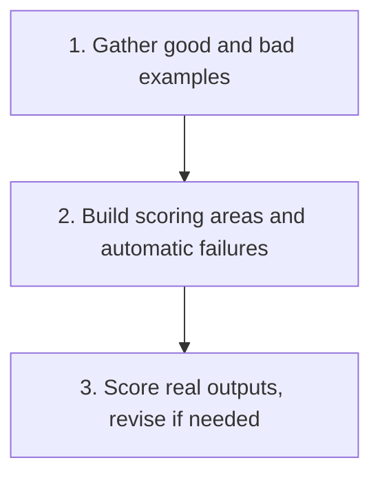

# Build Your Own AI Output Rubric

  
  

A tool for building a fixed scoring rubric for judging AI output in your own domain, instead of judging each result by gut feel.

## Why

"That looks good" is not the same as "that is accurate, safe, and ready to use." Most people using AI for repeated, real-stakes output never define what a good result actually looks like before they start trusting it. A rubric fixes that, scoring the same checklist every time so a weak spot gets caught before it causes a real problem, not after.

## Use It

Copy [SKILL.md](SKILL.md) and paste it into your AI tool (ChatGPT, Claude, Gemini, or similar), then answer its questions about your own repeated task: what it is, a couple of genuinely good examples, one bad example and what specifically made it bad, and what a missed failure would cost. It builds:

- **Scoring areas**, the things that would each independently make an output good or bad, not one overall gut feeling
- **A five-point scale**, defined clearly enough that two different people would score the same output the same way
- **Automatic failure conditions**, the genuinely unacceptable outcomes that fail an output regardless of its score
- **What to record**, so a correction actually feeds back into a better prompt next time, not just a number

See [the worked example](example/): building a rubric for AI-drafted customer support replies, then applying it to a new reply that fails in a subtler way than the original bad example it was built from, to check the rubric actually generalises rather than only catching the exact case it saw. [The second worked example](example-two/) tests the harder, opposite case: when there is no real bad example yet, and the honest answer is to stop rather than guess.

Use [the blank template](templates/rubric-template.md) once you have your own scoring areas worked out, and [the review checklist](checks/checklist.md) before trusting a finished rubric on anything with real stakes.

<strong>See exactly what it produces</strong>

1. A scoring sheet: your own areas, each with what to check, scored 1 to 5
2. A one-line meaning for every point on the scale, so two different people would score the same output the same way
3. An automatic-failure list, the genuinely unacceptable outcomes, kept separate from the scored areas
4. A "what to record" section, so a correction actually feeds back into a better prompt next time

No installation, project, or coding required to try it once.

## Before You Use It

A rubric built here is a starting point, not a finished law. Test it against a handful of real outputs and check whether the scores actually match what a careful human would conclude before trusting it for anything with real stakes.

## Licence

MIT.

## Feedback

Built a rubric for your own domain? [Start a discussion](https://github.com/shaunmarsden/build-your-own-rubric/discussions) if an area was missing or the process did not fit your task.

## Part of a Family

This is one of a family of free tools generalising [practical-ai-sales-workflows](https://github.com/shaunmarsden/practical-ai-sales-workflows) patterns beyond sales. See [sibling-projects](https://github.com/shaunmarsden/sibling-projects) for the rest, or use [the router](https://github.com/shaunmarsden/sibling-projects/blob/main/ROUTER.md) if you are not sure which one actually fits.
